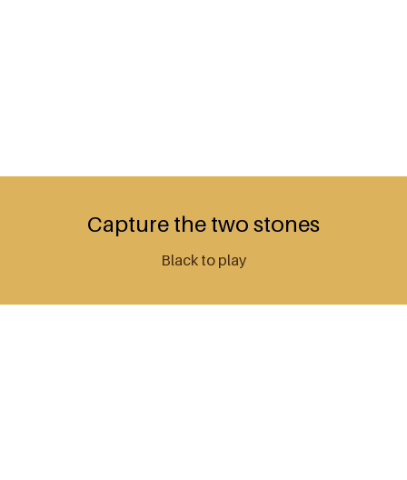

# 9x9 Go AI: neural network + tree search



A tech-watch project on game AI: a 9x9 Go player in Python. A convolutional neural network (Keras)
estimates who wins a position, and two search engines use it:

- **Alpha-Beta** with iterative deepening, evaluating one position per call;
- **Monte-Carlo tree search** (UCT) that evaluates leaves in batches with the same network, about
  12,000 simulations per 5-second move.

An arena makes them play each other and GnuGo, and tactical puzzles double as tests and as the videos above.

## Puzzles

Each puzzle is a pytest test: MCTS must find the answer with a fixed seed and 3,000 simulations.
Positions the network does not understand are kept as strict `xfail` tests and shown as known limits.

| Puzzle | Answer | MCTS | Alpha-Beta |
|---|---|---|---|
| Capture the two stones | E6 | E6 ✅ | E6 ✅ |
| Take the bigger capture | E2 | E2 ✅ | E2 ✅ |
| Connect before White cuts | E5 | E5 ✅ | E5 ✅ |
| Escape from atari | E6 | G6 ❌ | H5 ❌ |
| Make two eyes | B1 | E6 ❌ | E6 ❌ |
| Kill the group | B1 | F6 ❌ | F6 ❌ |
| Trap the stone in a net | F6 | F4 ❌ | F4 ❌ |

Known limit: the network never learned life and death, and no amount of search makes up for it.

## Arena

| Match | Games | MCTS wins | Alpha-Beta wins | Draws (move cap) | MCTS wins as Black / White |
|---|---|---|---|---|---|
| MCTS vs Alpha-Beta | 18 | 9 | 7 | 2 | 6 / 3 |

1 s per move, no komi, colors alternated every game. Against GnuGo level 1, MCTS still loses clearly
([full game](media/mcts-vs-gnugo.mp4)).

## Quick start

Requires [uv](https://docs.astral.sh/uv/) and, for the GnuGo opponent, `brew install gnu-go`.

```bash
uv sync
uv run go-player play --black mcts --white random --time 2
uv run go-player puzzles
uv run go-player record --black mcts --white gnugo
uv run go-player arena --games 20 --time 1
uv run pytest
```

Players: `random`, `gnugo`, `alphabeta`, `mcts` (network at the leaves), `mcts-rollout` (random playouts, baseline).

## Layout

- `go_player/`: rules engine, value network, players, arena, recorder, puzzles, CLI
- `tests/`: pytest suite (rules, network, both searches, arena, recorder, puzzles)
- `media/`: generated GIFs, videos and results
- `GO/`, `ML/`: the original implementation and the network training notebook

## Credits

Laurent Genty and Johan Chataigner. Rules engine `Goban.py` by Laurent Simon (MIT).
